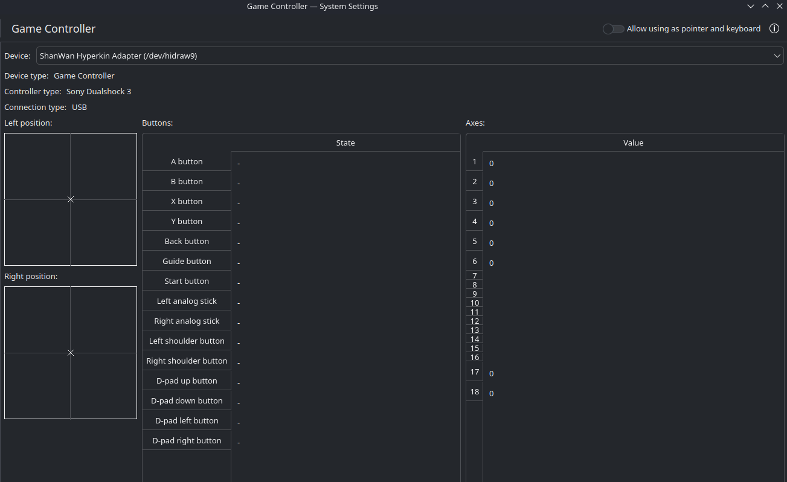

# Hyperkin N64 Adapter Fix for RetroDeck on Bazzite Linux

Fixes controller support for the Hyperkin / ShanWan USB N64 controller adapter in RetroDeck and RetroArch on Linux.

This setup enables:

- Proper controller detection in RetroDeck menus (ES-DE)
- Correct RetroArch button mapping
- Working Z trigger and C-buttons
- Automatic SDL2 controller mapping
- Persistent RetroArch autoconfig support

Designed and tested on:

- Bazzite Linux
- RetroDeck Flatpak
- ShanWan-based Hyperkin N64 USB adapter

---

# Problem

Out of the box, the Hyperkin/ShanWan N64 adapter has several issues on Linux:

- Incorrect or missing button mappings
- RetroArch ignoring custom autoconfigs
- RetroDeck Flatpak sandbox blocking input access
- RetroArch bindings overriding autoconfig files

This repository fixes all of those issues automatically.

---

# Included Files

| File                           | Purpose                         |
| ------------------------------ | ------------------------------- |
| `setup-hyperkin-n64.sh`        | Installs and configures the fix |
| `uninstall-hyperkin-n64.sh`    | Removes all changes safely      |
| `ShanWan Hyperkin Adapter.cfg` | RetroArch autoconfig profile    |

---

# Requirements

- Bazzite Linux or similar
- RetroDeck installed as Flatpak:
  - `net.retrodeck.retrodeck`
- Hyperkin Controller Adapter for N64 set to **PC mode**
- Bash shell

---

# Installation

Clone the repository:

```bash
git clone https://github.com/alex-engelmann/hyperkin_n64_retrodeck.git
cd hyperkin_n64_retrodeck
```

Make the scripts executable:

```bash
chmod +x setup-hyperkin-n64.sh
chmod +x uninstall-hyperkin-n64.sh
```

Run the setup script:

```bash
./setup-hyperkin-n64.sh
```

Then restart RetroDeck.

---

# What the Setup Script Does

The installer performs the following steps:

1. Grants RetroDeck Flatpak access to input devices
2. Creates an SDL2 controller mapping
3. Configures SDL2 environment overrides
4. Installs RetroArch autoconfig files
5. Clears default RetroArch controller bindings
6. Fixes RetroArch autoconfig directory handling

This allows RetroArch to properly load the custom controller profile instead of using broken default mappings.

---

# Uninstall

To completely remove all changes:

```bash
./uninstall-hyperkin-n64.sh
```

The uninstall script:

- Removes Flatpak overrides
- Removes SDL2 mappings
- Removes RetroArch autoconfigs
- Cleans RetroArch cached controller bindings
- Restores default RetroArch behavior

No RetroDeck factory reset should be necessary.

---

# Notes

- The adapter must be set to **PC mode**

---

# FAQ

### Will this work on other Linux distributions?

Probably, but I haven't tested it.

### Why did you make this?

By default, Bazzite doesn't detect the controller properly or any of it inputs in KDE.  See screenshot -  

By creating an SDL wrapper and then adjusting the Retroarch bindings, the controller will work in Retrodeck menus and Retroarch.  

As an alternative - if you're using something like Rosalie's MUPEN GUI, the buttons can be mapped directly.  That app effectively creates an SDL wrapper when you press the inputs and configure it, but it won't work in Retrodeck/Retroarch.


### Will it work in console mode?

It didn't work in Retrodeck and it even crashed the KDE controller settings menu with the following error so I didn't have any luck. 

```bash
❯ systemsettings
org.kde.libkbolt: Failed to connect to Bolt manager DBus interface: 
kf.plasma.core: The theme "Vapor" uses the legacy metadata.desktop. Consider contacting the author and asking them update it to use the newer JSON format.
qt.qpa.services: Failed to register with host portal QDBusError("org.freedesktop.portal.Error.Failed", "Could not register app ID: Connection already associated with an application ID")
terminate called after throwing an instance of 'std::logic_error'
  what():  basic_string: construction from null is not valid
Aborted                    (core dumped) systemsettings


```

### Are you affiliated with ShanWan or Nintendo?

No, just a hobbyist sharing a fix with others.

---

# License

GPL-3.0

---

# Credits

Created for the RetroDeck + Bazzite Linux community.

Special thanks to the SDL2 and RetroArch projects.
